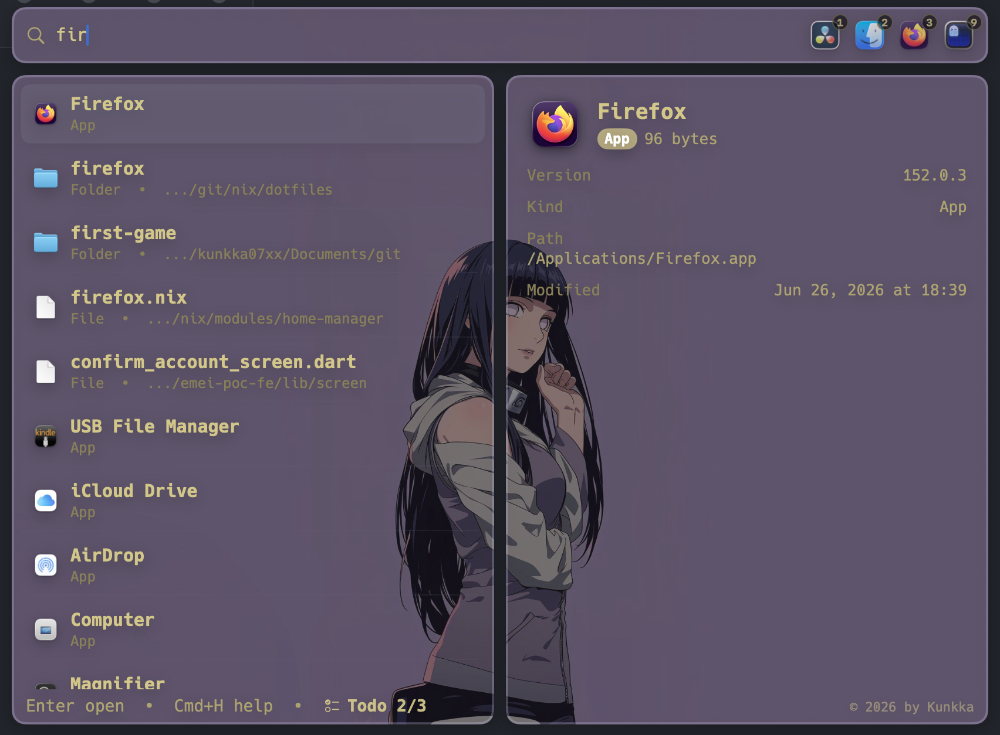
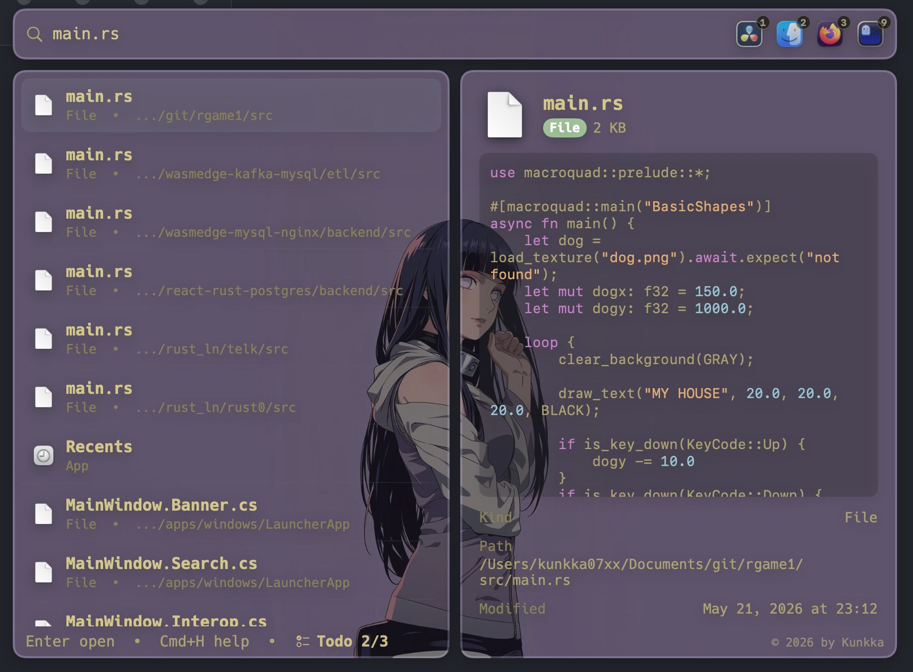
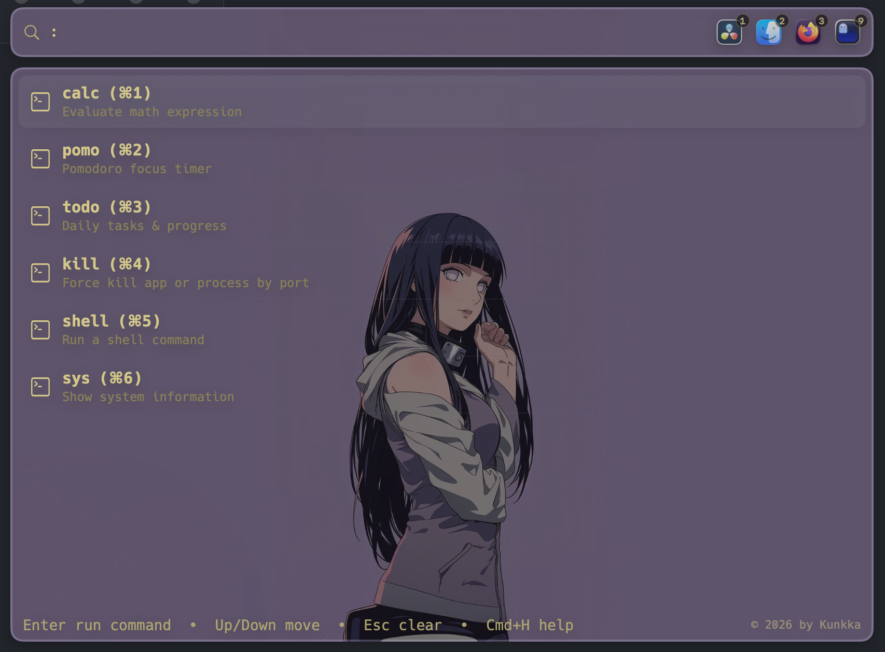
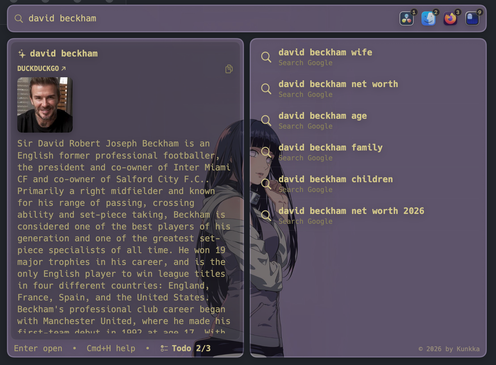
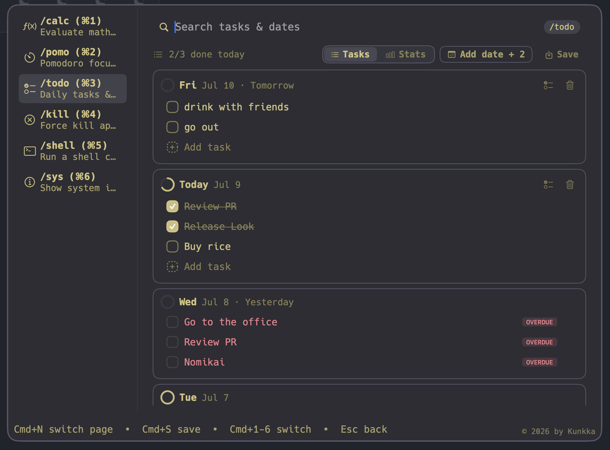
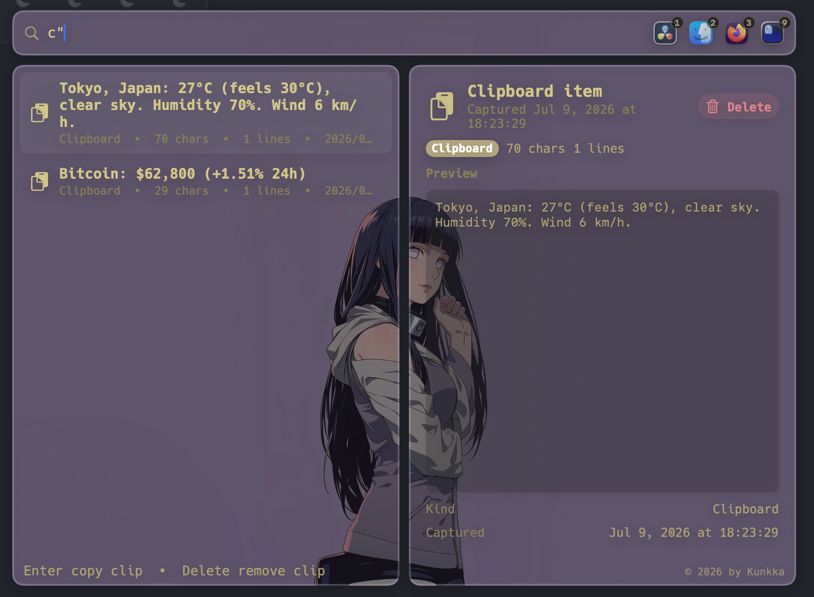

# look


A keyboard-first, local-first launcher for macOS, Windows, and Linux. Open apps, files, folders, clipboard history, and quick commands without leaving the keyboard.

[macOS](#macos) · [Windows](#windows) · [Linux](#linux-under-development)
📘 [Docs](https://noah-code.com/docs/look) · 📖 [User guide](docs/user-guide.md) · 🎬 [Demo video](https://www.youtube.com/watch?v=4Twb4We3PIs)

https://github.com/user-attachments/assets/176a929d-edbe-46a0-a0c5-229eb9b31c1c

## Install

### macOS

```bash
brew tap kunkka19xx/tap
brew install --cask look
```

Then bind `Cmd+Space` to Look (disable Spotlight's shortcut in `System Settings > Keyboard > Keyboard Shortcuts > Spotlight`). Release builds are signed and notarized — no Gatekeeper bypass needed.

### Linux

Released artifacts are **x86_64 only**. ARM builds aren't published; if you need one, please open an issue.

**Arch Linux (AUR):**

```bash
yay -S look-bin
# or
paru -S look-bin
```

Or without an AUR helper:

```bash
git clone https://aur.archlinux.org/look-bin.git
cd look-bin
makepkg -si
```

**Ubuntu/Debian:**

```bash
curl -fsSL https://raw.githubusercontent.com/kunkka19xx/look/main/scripts/linux/install-look.sh | bash
```

Or download the `.deb` manually from [Releases](https://github.com/kunkka19xx/look/releases) and run `sudo dpkg -i Look_*.deb`.

**Any distro (AppImage):**

```bash
chmod +x Look_*.AppImage
./Look_*.AppImage
```

After installing, launch with `lookapp` from a terminal, or search "Look" in your app launcher. Press `Alt+Space` to toggle the window at any time. Look autostarts on login by default (on full DEs like GNOME/KDE).

Uninstall:

```bash
# Arch
yay -R look-bin

# Ubuntu/Debian
sudo dpkg -r lookapp

# AppImage — just delete the file
rm Look_*.AppImage
```

**NixOS (flake):**

```bash
# Run directly
nix run github:kunkka19xx/look?dir=apps/linows

# Install to profile
nix profile install github:kunkka19xx/look?dir=apps/linows
```

Declarative (NixOS):

```nix
# flake.nix — add input and cachix config
{
  nixConfig = {
    extra-substituters = [ "https://look.cachix.org" ];
    extra-trusted-public-keys = [ "look.cachix.org-1:8elPCeSVBzlDZXqIRKBK9GyLIK/Hoe1xiWZF0ir7uX4=" ];
  };

  inputs.look.url = "github:kunkka19xx/look?dir=apps/linows";
  # ... your other inputs
}

# configuration.nix — add package
{ pkgs, inputs, ... }:
{
  environment.systemPackages = [
    inputs.look.packages.${pkgs.system}.default
  ];
}
```

Pre-built binaries are served via [Cachix](https://look.cachix.org). On first rebuild, nix will ask to trust the cache — say yes. No source compilation needed.

Update to latest release:

```bash
nix flake update look --flake /path/to/your/flake
sudo nixos-rebuild switch --flake /path/to/your/flake#hostname
```

> **Note:** On GNOME desktops, log out and log back in after the first install so the GNOME Shell extension (used for window focusing and hotkey on Wayland) can load.

**Window manager users (i3, sway, Hyprland, etc.):** Autostart via `.desktop` files only works on full DEs (GNOME, KDE). On standalone WMs, add Look to your config manually. The `Alt+Space` hotkey and window rules (float, no border) are registered automatically at runtime — you only need the autostart line:

```bash
# i3: ~/.config/i3/config
exec --no-startup-id lookapp
# (Alt+Space works via X11 global shortcut plugin)

# sway: ~/.config/sway/config
exec lookapp
# (Alt+Space, float, and border rules are injected automatically via swaymsg)

# Hyprland: ~/.config/hypr/hyprland.conf
exec-once = lookapp
# (Alt+Space, float, and border rules are injected automatically via hyprctl)
```

> **Hyprland 0.55+ only.** Focus-existing-window uses the `wlr-foreign-toplevel-management` protocol. Older Hyprland versions relied on the legacy `hyprctl dispatch focuswindow` syntax which was deprecated in 0.55; selecting an already-running app on <0.55 may launch a second instance instead of focusing. Upgrade to 0.55+ for correct behavior.

To build from source, see [apps/linows/BUILDING.md](apps/linows/BUILDING.md).

### Windows

Released artifacts are **x86_64 only**. Windows on ARM (Surface Pro X / Snapdragon X) can run the x64 build under emulation; native ARM builds aren't published — open an issue if you need one.

One PowerShell line, no admin required:

```powershell
iex "& { $(irm https://raw.githubusercontent.com/kunkka19xx/look/main/scripts/windows/install-look.ps1) }"
```

The script resolves the latest release, downloads the NSIS installer, verifies its SHA256 against the published checksums, and runs it silently into `%LOCALAPPDATA%\Programs\Look`. SmartScreen will warn on the first download while reputation builds — click "More info → Run anyway" if Windows blocks the script itself.

Uninstall:

```powershell
iex "& { $(irm https://raw.githubusercontent.com/kunkka19xx/look/main/scripts/windows/install-look.ps1) } -Uninstall"
```

The launcher's global hotkey is `Alt+Space` (not user-configurable yet — if it conflicts with another app you use, remap that one). For a manual install: download `Look_<version>_x64-setup.exe` from [Releases](https://github.com/kunkka19xx/look/releases/latest), verify the SHA256 against the published `Look-<version>-windows-checksums.txt`, then run. Uninstall via Settings → Apps or `%LOCALAPPDATA%\Programs\Look\uninstall.exe`. To wipe user data: `Remove-Item -Recurse "$env:LOCALAPPDATA\look"`.

<details>
<summary>Other install options (curl, pin version, update/uninstall)</summary>

**macOS — Homebrew update / uninstall:**

```bash
# update
brew upgrade --cask kunkka19xx/tap/look

# uninstall
brew uninstall --cask look
```

**macOS — curl installer:**

```bash
curl -fsSL https://raw.githubusercontent.com/kunkka19xx/look/main/scripts/install-look.sh | bash
```

Pin a specific version or repo fork:

```bash
curl -fsSL https://raw.githubusercontent.com/kunkka19xx/look/main/scripts/install-look.sh | bash -s -- --version <version> --repo kunkka19xx/look
```

Direct URL:

```bash
curl -fsSL https://raw.githubusercontent.com/kunkka19xx/look/main/scripts/install-look.sh | bash -s -- --url "https://github.com/kunkka19xx/look/releases/download/v<version>/Look-<version>-macOS.zip"
```

CLI naming note: macOS ships `/usr/bin/look`, so terminal command examples use `lookapp`.

If Look is fully quit and Spotlight is still unbound, relaunch from Launchpad, or via:

```bash
open "/Applications/Look.app"
```

</details>

## What you can do

- **Find and open anything** — apps, files, folders indexed locally. Type, Enter, done.
- **Calc inline** — type `2^10`, `4!`, `200*15%`, `sqrt(2)`, `2*pi`. No command mode needed.
- **Kill a process by port** — `Cmd+/` then `kill :3000`. Confirms before killing.
- **Search clipboard history** — `c"meeting` finds the snippet you copied an hour ago.
- **Translate or look up a word** — `t"hello` for quick translation, `tw"word` for a definition panel.
- **Regex, path, and kind-scoped search** — `r"^Visual.*`, `git/project/readme`, `a"safari`, `f"note`, `d"documents`.

All local. No account. No telemetry. No plugin marketplace to manage.

## Why look

- **Fast** — typical search under 1 ms on a 2000-item index; empty-query browse under 30 µs.
- **Small** — single native macOS app, no Electron, no background daemons.
- **Local-first** — candidates indexed in a local SQLite file; the only network calls are explicit (`t"`, `tw"`, `Cmd+Enter` web search).
- **Zero-config by default** — presets cover common apps (`alias_note`, `alias_code`, `alias_term`, `alias_chat`, `alias_music`, `alias_brow`). Configure more via `~/.look.config` when you want to.
- **Keyboard-first** — every action has a key; mouse never required.

If you want a launcher that stays out of your way and does exactly what you asked, that's the pitch.

## Essential shortcuts

| Action                                        | macOS            | Windows             | Linux            |
| --------------------------------------------- | ---------------- | ------------------- | ---------------- |
| Toggle launcher                               | `Cmd+Space`      | `Alt+Space`         | `Alt+Space`      |
| Open / run                                    | `Enter`          | `Enter`             | `Enter`          |
| Web search                                    | `Cmd+Enter`      | `Ctrl+Enter`        | `Ctrl+Enter`     |
| Reveal in file manager                        | `Cmd+F` (Finder) | `Ctrl+F` (Explorer) | `Ctrl+F` (Files) |
| Command mode (`calc`, `shell`, `kill`, `sys`) | `Cmd+/`          | `Ctrl+/`            | `Ctrl+/`         |
| Settings                                      | `Cmd+Shift+,`    | `Ctrl+Shift+,`      | `Ctrl+Shift+,`   |
| Back / hide                                   | `Escape`         | `Escape`            | `Escape`         |

(Throughout the rest of the docs, `Cmd+X` on macOS maps to `Ctrl+X` on Windows and Linux; the launcher-toggle hotkey uses `Alt+Space` on Windows/Linux instead of `Cmd+Space` because `Win+Space` / `Super+Space` are typically reserved by the OS or desktop environment.)

Full reference: [docs/user-guide.md](docs/user-guide.md).

## Themes

Built-in: Catppuccin, Tokyo Night, Rose Pine, Gruvbox, Dracula, Kanagawa, plus Custom. Switch in `Settings > Appearance`.

<p align="center">
  
  
</p>
<p align="center">
  
  
</p>
<p align="center">
  
  
</p>

## Documentation

- 📘 [Docs site](https://noah-code.com/docs/look) — hosted, searchable user guide and reference
- [User guide (in-repo)](docs/user-guide.md) — full feature reference, shortcuts, configuration, permissions, troubleshooting
- [Architecture](docs/architecture.md) — how the Swift app + Rust core fit together
- [Features](docs/features.md) — what's shipped, what's planned
- [Contributing](CONTRIBUTING.md) — how to contribute
- [Development](DEVELOPMENT.md) — building locally, repo layout, release process

## Scope

In scope:

- apps, files, folders, clipboard, command mode, translation, regex/path search
- local-first behavior, zero telemetry
- near-term plugin/extension exploration

Out of scope for v1:

- online-first behavior
- semantic/vector search
- full content indexing (names and metadata only)

### Platform direction

- **macOS** — shipped and stable (SwiftUI, native). This is the design source of truth.
- **Windows + Linux** — a new shared Tauri v2 app (`apps/linows/`) is under active development. It targets both platforms with a single codebase (Rust backend, vanilla HTML/CSS/JS frontend). Current status:
  - Core search, preview, multi-pick, clipboard history, translation — done
  - Command mode (calc, pomo, kill, shell, sys) — done
  - Settings screen (appearance, themes, blur, font autocomplete) — done
  - Platform-aware blur (Mica/Acrylic on Windows, CSS backdrop-filter on Linux)
  - Dynamic window scaling based on monitor resolution
  - 6 built-in themes + Custom
- **Windows (WinUI3)** — the current `apps/windows/` WinUI3/C# app is in maintenance mode (bug fixes only). It will be archived once the Tauri app reaches feature parity.

## License

MIT — see [LICENSE](LICENSE).

## Contributors

Thanks to everyone who has contributed — see the [contributor graph](https://github.com/kunkka19xx/look/graphs/contributors).

Contribution flow: branch from `dev`, open PRs into `dev`. See [CONTRIBUTING.md](CONTRIBUTING.md) and [DEVELOPMENT.md](DEVELOPMENT.md).
