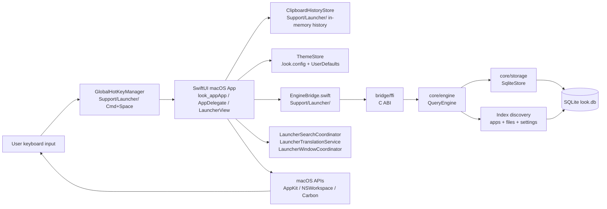
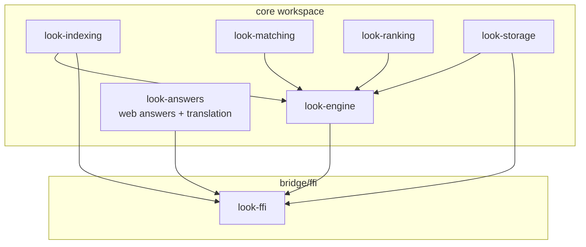
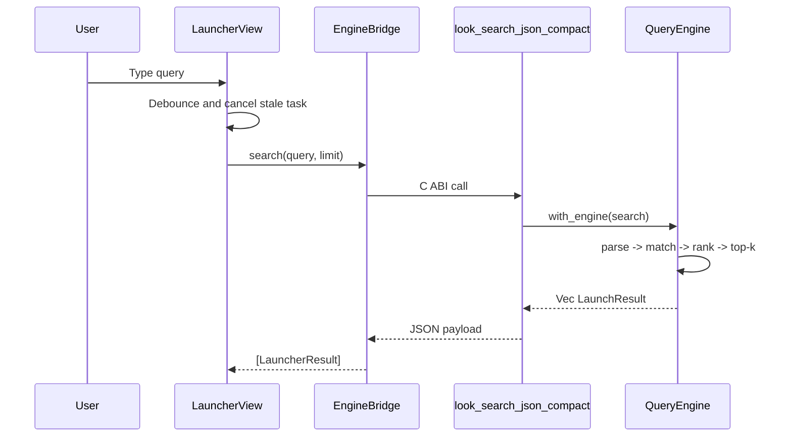
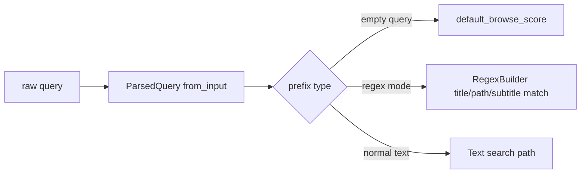
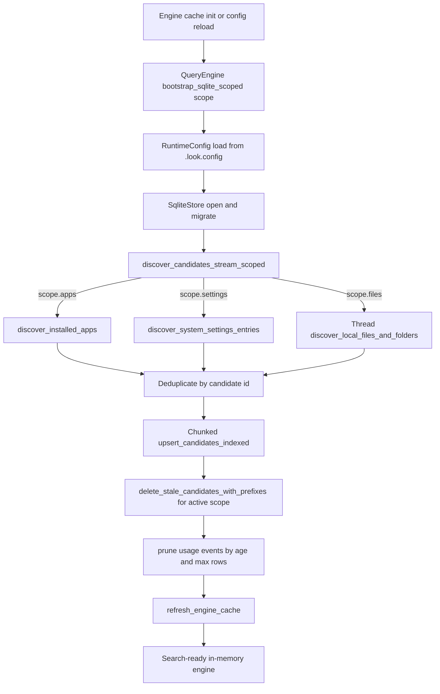
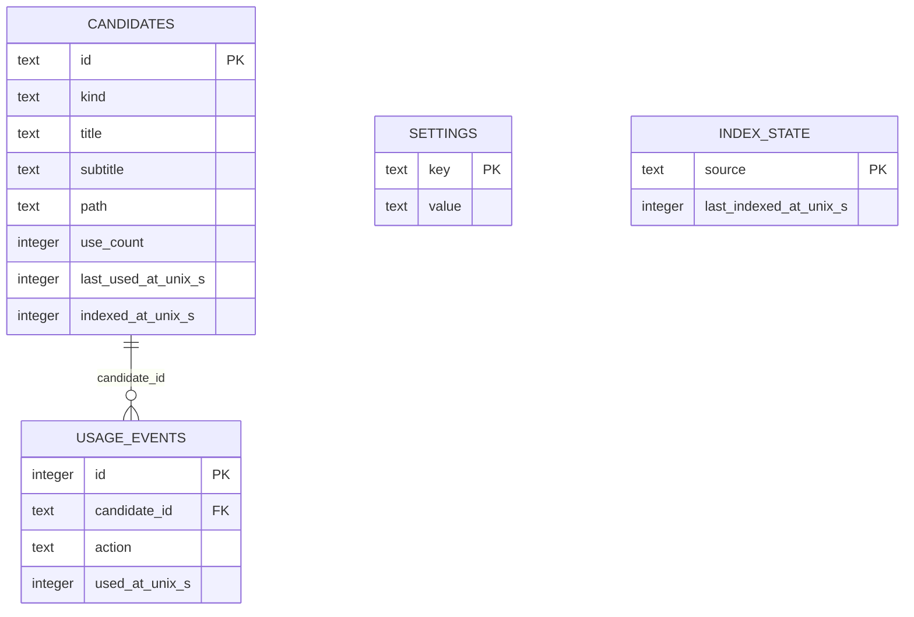
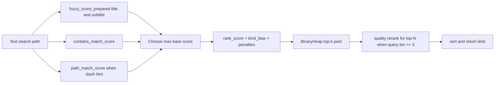
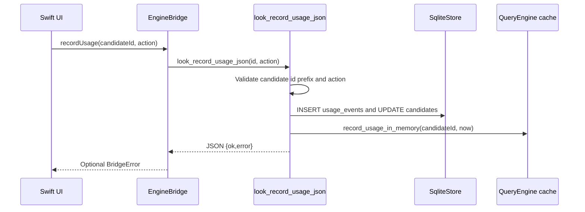
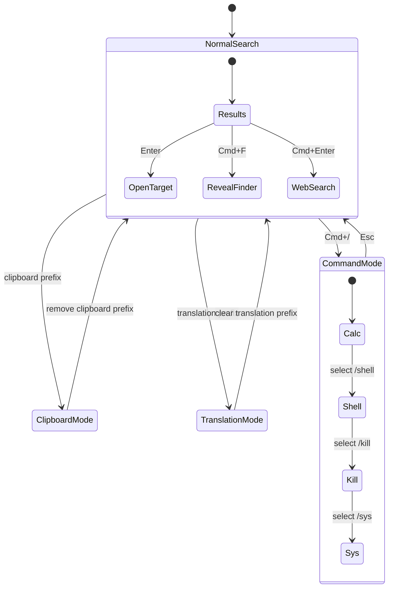

# Architecture Guide

This is the canonical architecture document for `look`.

It intentionally merges architecture explanation and diagrams into one place, so design decisions and Mermaid views stay in sync.

## 1) System overview and design intent

`look` is a keyboard-first launcher (macOS shipped, Windows + Linux in active development) designed for low-latency local search. The architecture separates UI concerns from search/index/ranking concerns (Rust), joined through a small FFI/command boundary. The UI layer is platform-specific:

- **macOS:** Swift / AppKit / SwiftUI under `apps/macos/LauncherApp/` (Xcode project), talking to the Rust core via the C ABI (`bridge/ffi`).
- **Windows + Linux:** Tauri 2 shell with a vanilla HTML/CSS/JS frontend under `apps/linows/` (`lookapp`), talking to the Rust core via Tauri commands. The macOS SwiftUI app is the design source of truth.

> **Note:** the legacy .NET 10 / WinUI 3 app under `apps/windows/LauncherApp/` is **archived** and being replaced by `linows` (bug fixes only - do not add features). See `apps/windows/README.md`.

Every shell talks to the same Rust core, so search, indexing, ranking, and storage behave identically across platforms.

Key design goals:

- low per-keystroke latency,
- predictable behavior as candidate volume grows,
- practical relevance via text quality + usage/recency,
- local-first storage and processing,
- narrow, stable bridge between frontend and backend.

---

## 2) Module boundaries and responsibilities

- `apps/macos/LauncherApp/look-app`: launcher window, keyboard input, global hotkey, action dispatch, clipboard/history mode, command mode, theme/settings UX.
- `Support/Launcher/`: launcher-specific services and utilities:
  - `LauncherSearchCoordinator`: debounce + async search lifecycle
  - `LauncherTranslationService`: translation lookup
  - `LauncherWindowCoordinator`: window/focus management
  - `EngineBridge`: search engine communication
  - `ClipboardHistoryStore`, `KeyboardSelectionMonitor`, `GlobalHotKeyManager`
- `Themes/`: builtin theme presets (Catppuccin, Tokyo Night, Rose Pine, Gruvbox, Dracula, Kanagawa) and semantic color tokens
- `bridge/ffi`: narrow C ABI surface for search, usage recording, config reload, translation, todo load/save, and error payloads.
- `core/answers`: platform-agnostic, network-backed "web answer" lookups shared by every shell (macOS via `bridge/ffi`, Windows/Linux via Tauri commands). Instant answers (currency/weather/crypto), search suggestions, knowledge sources, and translation. Best-effort and panic-free: every entry point returns "no answer" on failure, with cheap network-free pattern-gating (`has_match`) so callers can fire speculatively while typing. No async runtime - HTTP is a blocking `curl` subprocess.
- `core/indexing`: candidate model and indexing helpers used by engine/storage flows.
- `core/matching`: exact/prefix/fuzzy matching primitives.
- `core/ranking`: ranking helpers (usage/recency-aware adjustments and score composition).
- `core/storage`: SQLite integration, schema/migrations, candidate/usage persistence.
- `core/todo`: shared store for the `/todo` command. Owns the `todo_tasks` table inside the app's existing `look.db` (full-set load/save, one-year retention). macOS reaches it via `bridge/ffi`, linows via its Tauri command layer. `examples/seed.rs` fills a dev database with demo history.
- `core/engine`: query parsing, indexing orchestration, scoring, top-k retrieval, in-memory cache management.

---

## 3) Request path and query understanding

Search request path:

Query mode parsing in engine supports explicit prefixes:

- `a"` app-only,
- `f"` file-only,
- `d"` folder-only,
- `r"` regex mode,
- empty query browse mode.

Normalization uses Unicode decomposition and diacritic folding to improve matching consistency across accented input.

---

## 4) Indexing and persistence lifecycle

The indexing flow is designed as a bounded pipeline:

- discover candidates from apps/files/settings,
- deduplicate by id,
- chunked upsert to SQLite,
- delete stale entries,
- prune usage history,
- refresh in-memory cache for fast queries.

Runtime refresh triggers:

- file-system watcher monitors configured app/file roots and marks in-memory `index_dirty` on create/remove/rename events,
- launcher open (`Cmd+Space`) requests background refresh through FFI,
- refresh execution mode depends on `lazy_indexing_enabled`:
  - `true`: run only when dirty,
  - `false`: run on every launcher open request.

Watcher policy (linows, see `apps/linows/src-tauri/src/state.rs`):

- **apps roots** (`/usr/share/applications`, `~/.local/share/applications`, `XDG_DATA_DIRS/applications`) - watched **recursively** (small directories, cheap),
- **file roots** (`~/Documents`, `~/Downloads`, `~/Desktop`, `file_scan_extra_roots`) - watched **non-recursively** to bound inotify watch count on large trees; deep-tree changes reconciled on next launcher-open refresh,
- **noise filter** suppresses events whose every path is a synthetic file (vim `.swp`, browser `.crdownload`/`.part`, Office `~$lock`, OS droppings),
- **debounce** (2 s) coalesces bursts before firing a refresh,
- **cooldown** (10 s) caps watcher-triggered refresh rate at ≤ 6/min; explicit launcher-open refreshes bypass it,
- **scoped refresh** - `QueryEngine::bootstrap_sqlite_scoped(path, scope)` re-walks only the dirty source family (apps-only / files-only / all). Stale deletion is scoped to the same id prefixes so unrelated rows survive,
- **off-thread reindex** - the watcher loop spawns a worker thread to run the bootstrap, so subsequent events keep draining instead of queuing in the kernel buffer,
- **RAII slot guard** ensures a panic inside the worker still releases the in-progress flag.

Benchmarks for this path live in `tools/perf/` (see [tools/perf/WATCHER_PERF.md](../tools/perf/WATCHER_PERF.md)).

Persistence model:

---

## 5) Ranking, actions, and feedback loop

Search ranking combines multiple signals:

- fuzzy title/subtitle matching,
- contains/token and path matching,
- usage/recency-aware score adjustments,
- kind bias and path depth penalties,
- bounded top-k selection and optional rerank.

Usage recording closes the loop by updating persistent and in-memory state after open actions:

---

## 6) UI behavior, operational notes, and performance targets

UI interaction modes:

Behavioral notes:

- global hotkey `Cmd+Space` toggles launcher visibility,
- web search is explicit handoff (`Cmd+Enter`),
- clipboard history mode is shell-side and in-memory for current session,
- command mode supports `calc`, `shell`, `kill`, `sys`,
- settings panel controls theme/index/runtime knobs and persists locally.

---

## 7) Theme System

The theme system uses semantic color tokens for consistent theming across all built-in themes:

### Color Hierarchy

- **Main text (`fontColor`)**: Primary text color, user-configurable via font RGB sliders
- **Secondary text (`secondaryTextColor`)**: Section headers, labels
- **Muted text (`mutedTextColor`)**: Hints, subtitles, less important text
- **Panel fill (`panelFillColor`)**: Input fields, panels
- **Control fill (`controlFillColor`)**: Buttons, controls
- **Divider (`dividerColor`)**: Borders, separators
- **Selection (`selectionFillColor`)**: Selected item highlight
- **Accent (`accentColor`)**: Links, interactive elements
- **Success/Warning/Danger**: Semantic state colors

### Text Color Derivation (Custom Mode)

In "Custom" mode, semantic text colors auto-derive from main text color:
- Secondary = 82% brightness of main text
- Muted = 64% brightness of main text

This ensures good contrast whether using light or dark themes.

### Built-in Themes

Available themes (selected via Settings > Appearance):
| Theme | Description |
|-------|-------------|
| Catppuccin | Warm pastels (Mocha variant) |
| Tokyo Night | Dark with vibrant accents |
| Rose Pine | Soft pink-tinted dark theme |
| Gruvbox | Retro warm tones |
| Dracula | Classic purple-accented dark |
| Kanagawa | Japanese-inspired dark theme |
| Custom | Auto-derived semantic colors from tint |

Themes are defined in `Themes/` folder:
- `BuiltinThemeStyle`: Base style with all color tokens
- `BuiltinThemePreset`: Dropdown selection enum
- Individual theme files: `CatppuccinTheme.swift`, `TokyoNightTheme.swift`, etc.

### Config File Integration

All settings are persisted to `.look.config`:

**UI Theme:**
- `ui_theme` - theme name (catppuccin, tokyoNight, rosePine, gruvbox, dracula, kanagawa)

**Appearance:**
- `ui_tint_red`, `ui_tint_green`, `ui_tint_blue`, `ui_tint_opacity` - background tint (0-1)
- `ui_blur_material` - blur style (hudWindow, sidebar, menu, underWindowBackground)
- `ui_blur_opacity` - blur opacity (0-1)
- `ui_font_name`, `ui_font_size` - font settings
- `ui_font_red`, `ui_font_green`, `ui_font_blue`, `ui_font_opacity` - text color (0-1)
- `ui_border_thickness`, `ui_border_red`, `ui_border_green`, `ui_border_blue`, `ui_border_opacity` - border

**Background Image:**
- `ui_background_image` - path to image file
- `ui_background_image_mode` - fill, fit, tile, stretch
- `ui_background_image_opacity` - overlay opacity (0-1)
- `ui_background_image_blur` - blur radius

**Settings:**
- `settings_blur_multiplier` - settings panel blur (0-1)

**File Scanning:**
- `file_scan_depth` - max depth (1-12), default: 4
- `file_scan_limit` - max files (500-50000), default: 4000
- `file_exclude_paths` - comma-separated paths to exclude

**Runtime:**
- `backend_log_level` - error, info, debug
- `launch_at_login` - true/false

### Config Reload Validation

When reloading (Cmd+Shift+;), invalid values are detected and shown:
- Values outside valid range (e.g., opacity > 1)
- Unknown theme names
- Invalid numbers

Warnings appear in banner with copy button for easy debugging.

On startup, theme is loaded from config and applied.

---

Performance targets:

- launcher appearance under ~50 ms perceived latency,
- query update under ~10 ms for top-N from memory,
- near-zero idle CPU,
- stable memory footprint.
